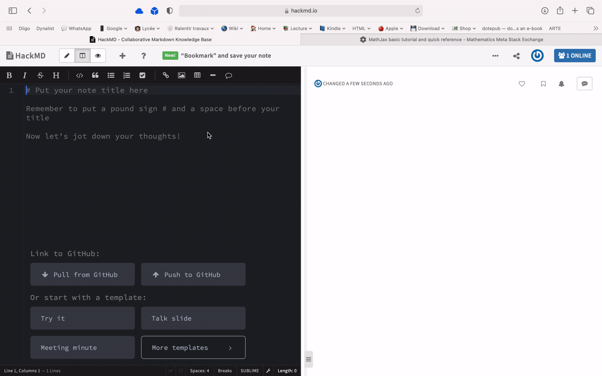

# What is an ePub file and why you are going to love it

## What’s an ePub?
That is a fact: teachers love books. But for whatever reason it is, when they have to deliver content to their students, their first choice is a Word document, a PDF or maybe a website such as Google site, not a book. To be honest, I have not the faintest idea why.

But you should give it a try. Write your first ePub (short for /electronic publication/), the [standard digital format for ebooks](https://en.wikipedia.org/wiki/EPUB)? I promise you, you are going to enjoy it.

As it is a standard, ePubs can be read anywhere: on a PC, on a Mac, on an Android tablet or even better an e-reader, which offer great comfort for your eyes.

## Why ePubs?
Think about it. When you do, students get great rich content. 

In an ePub, students will be able to: 

1. Use the built-in dictionary. 
2. Highlights what they find important.
3. They will be able to take notes and even export them.
4. They can change the font or increase the font size if they want (handy for those who are dyslexic).
5. Disable students will be able to take advantage of [Speak Selection](https://mcmw.abilitynet.org.uk/speak-selection-iphoneipadipod-touch-ios-12) which can read the text to you.

On top of that, you can insert audio content and even videos to your ePub. You can even find software allowing you to insert quizzes in your book.

In addition, if you provide an ePub with all the content say for the next week or maybe the next term, you won’t rely on the wifi anymore. Students download their digital book. They have it on their tablet or computer. So if the connection fails, students still have access to your content and learning can still happen.

So ePub is a pretty obvious choice. Go for it.

But how can you create an ePub? Is that difficult?  How can you read an ePub? And where can you download books? 

All these questions are answered down below. Most of the time, things are pretty self-explanatory and I wanted to make this short and as simple as possible. In fact, you just write, click Export and that’s it. Moreover, you will find animated GIF so you know how to get things done.

- - - -

## Create an ePub with a word processor
* Pages ([iPad](https://apps.apple.com/gb/app/pages/id361309726) & [Mac](https://apps.apple.com/gb/app/pages/id409201541?mt=12) or your [web browser](https://www.icloud.com/). Read [this article](https://support.apple.com/en-gb/HT202066) to find advanced options)
* [Google Docs](https://docs.google.com/document/u/0/?tgif=d) (web browser, Mac, iPad...)
* [LibreOffice](https://fr.libreoffice.org/) (with the [eLAIX](https://extensions.libreoffice.org/en/extensions/show/elaix) extension or [Writer2epub](http://writer2epub.it/download/))
* [Scrivener](https://try.dabblewriter.com/scrivener/?gclid=EAIaIQobChMIqoKFlfyx7gIVhe_tCh3gcQewEAAYASAAEgLYDfD_BwE) (Windows & Mac)
* [Atlantis](https://www.atlantiswordprocessor.com/fr/) (Windows)
* [Ulysses](https://ulysses.app/) (iPad & Mac)
* [1Writer](https://apps.apple.com/gb/app/1writer-markdown-text-editor/id680469088) (iPad & Mac)
* [Bear](https://bear.app/) (iPad & Mac)

## Create an ePub with a dedicated app
* [Scribus](https://wiki.scribus.net/canvas/Download) (only  Windows and Linux support the ePub export)
* [Jutoh](http://www.jutoh.com/) (Windows, Linux & Mac)
* [Vellum](https://vellum.pub/) (Mac)
* [iBooks Author](https://itunes.apple.com/fr/app/ibooks-author/id490152466?ls=1&mt=12) (Mac but [no longer available to new users](https://support.apple.com/en-gb/HT211136))
* [Kindle Create](https://www.amazon.com/Kindle-Create/b?ie=UTF8&node=18292298011) (Windows & Mac)
* [Book Creator](https://bookcreator.com/) ([iPad](https://itunes.apple.com/app/book-creator-for-ipad/id442378070) or [online](https://app.bookcreator.com/sign-in))

##  Create an ePub online
* [Book Creator](https://app.bookcreator.com/sign-in)
* [HackMD](https://hackmd.io/)
* [Google Docs](https://docs.google.com/document/u/1/?tgif=d)
* [ePubEditor](http://www.epubeditor.it/home/home-en/)
* [Audra](http://www.audra.pub/index.php)
* [Omnibook](https://omnibook.pro/)

## Create an ePub on an iPad
* [Book Creator](https://omnibook.pro/) (+ [Book Creator One](https://apps.apple.com/gb/app/book-creator-one/id661166101))
* [Creative Book Builder](http://getcreativebookbuilder.blogspot.com/) (+ [Creative Widget Builder](https://apps.apple.com/gb/app/creative-widget-builder/id1091282414))
* [Book Writer](http://goodeffect.com/)

## Create an ePub on an Android tablet
* [Creative Book Builder](https://play.google.com/store/apps/details?id=com.tigernghk.android.cbb&hl=en&gl=GB)

## Export into ePub format
* [Dotepub](http://dotepub.com/) (allows you to convert any webpage into an ebook. If you need help, read [How to convert Web pages to e-books](https://www.cnet.com/how-to/how-to-convert-web-pages-to-e-books/). If you prefer the Chrome extension, [visit this page](https://chrome.google.com/webstore/detail/dotepub/okpfiebkkmjcnodegbbbiellepfhoglm).)
* [ePub Creator](https://chrome.google.com/webstore/detail/epub-creator/dholphmppikkchmalilfkmfanembgbil) (Chrome extension to create offline ebooks from web pages)
* [Calibre](https://calibre-ebook.com/) (follow [this method](https://justpublishingadvice.com/how-to-convert-word-to-epub/) to convert a Word document)
	
	
	
## Edit an ePub on your computer
* [Sigil](https://sigil-ebook.com/) (to download Sigil, [visit the GitHub webpage](https://github.com/Sigil-Ebook/Sigil/releases/tag/1.4.3))
* [BlueGriffon](http://www.bluegriffon-epubedition.com/BGEE.html)

## Useful sites about ePubs
* [Créer un ePub](http://flossmanuals.developpez.com/tutoriels/epub/)  🇫🇷
* [Comment réaliser un livre au format ePub](http://www.tahitidocs.com/cours/epub/faireEpub.html)  🇫🇷
* [Comment lire des ePubs sur le Kindle](http://davidbosman.fr/blog/2011/10/14/comment-lire-des-epubs-sur-le-kindle-et-ou-trouver-des-ebooks-en-francais-sans-drm/)  🇫🇷
* [Removing DRM from most ebooks](http://apprenticealf.wordpress.com/2012/09/10/calibre-plugins-the-simplest-option-for-removing-most-ebook-drm/) 
* [Jiminy Panoz’s website](http://jiminy.chapalpanoz.com/) 🇫🇷

## Avoid Grammar & Spelling mistakes
* [Antidote](http://www.antidote.info/) 
* [Le Robert correcteur](http://www.prolexis.com/lerobertcorrecteur/) 
* [Scribens](http://www.scribens.fr/) 
* [Le bon patron](http://bonpatron.com/) 
* [Language Tool](https://www.languagetool.org/) 
* [Grammarly](https://www.grammarly.com/)

## Pick a licence
* [Creative Commons](https://creativecommons.org/share-your-work/) 

## Where to publish?
* [Apple Books](https://www.apple.com/fr/ibooks/) 
* [Google Play Store](https://play.google.com/books/publish/) 
* [Amazon](https://kdp.amazon.com/) 
* [Kobo](https://fr.kobo.com/writinglife) 
* [YouScribe](http://www.youscribe.com/) 
* [InLibroVeritas](http://inlibroveritas.net/) 

## Where can you download ePubs?
* [Gallica](http://gallica.bnf.fr/ebooks?tri=first_indexation_date*dec&lang=FR)  (select ePub in the [advanced search](https://gallica.bnf.fr/services/engine/search/advancedSearch/)
* [Project Gutenberg](http://www.gutenberg.org/) 
* [Je lis libre](http://www.crdp-strasbourg.fr/je_lis_libre/)  (Canopé de Strasbourg)
* [Feedbooks](http://fr.m.feedbooks.com/) 
* [ebooksgratuits](http://www.ebooksgratuits.org/) 
* [BookBub](https://www.bookbub.com/ebook-deals/free-ebooks)
* [Wattpad](http://www.wattpad.com/home) 
* [Oxford Owl](https://www.oxfordowl.co.uk/for-home/find-a-book/library-page/)
* [epubBooks](https://www.epubbooks.com)

## Download an ePub reader
* [Calibre](https://calibre-ebook.com/)  (Windows, Mac & Linux)
* [Books](https://itunes.apple.com/fr/app/ibooks/id364709193?mt=8)  (Mac, iOS & iPad OS)
* [EPUB Reader](https://apps.apple.com/gb/app/epub-reader-reader-for-epub-format/id972654880) (iOS & iPad OS)
* [Yomu](https://apps.apple.com/gb/app/yomu-ebook-reader/id562211012) (iOS & iPad OS)
* Google Play Books ( [Android](https://play.google.com/store/apps/details?id=com.google.android.apps.books&hl=fr)  and  [iOS & iPad OS](https://itunes.apple.com/fr/app/google-play-livres/id400989007?mt=8) )
* [Kobo](https://www.microsoft.com/en-in/p/kobo-ebooks/9wzdncrfj4q1?activetab=pivot:overviewtab) (Windows)
* [Nook](https://www.microsoft.com/en-in/p/nook-books-magazines-newspapers-comics/9wzdncrfj33h?rtc=1&activetab=pivot:overviewtab) (Windows)
* [Bookviser](http://bookviser.com/)  (Windows)
* [Freda](https://www.microsoft.com/en-in/p/freda/9wzdncrfj43b?ocid=badge&rtc=1&activetab=pivot:overviewtab) (Windows)
* [Stanza Desktop](https://stanza-desktop.en.softonic.com) (Windows)
* [FBReader](https://fbreader.org/)  (Windows, Linux, Android and Mac)
* Roxio Mediabook Reader ([Windows](https://www.microsoft.com/fr-fr/store/apps/roxio-mediabook-reader/9wzdncrfj2mb)  &  [iPad](https://itunes.apple.com/fr/app/roxio-mediabook/id806917051?mt=8) )
* [Moon+ Reader](https://play.google.com/store/apps/details?id=com.flyersoft.moonreader&hl=fr)  &  [Moon+ Reader Pro](https://play.google.com/store/apps/details?id=com.flyersoft.moonreaderp)  (Android)
* [Universal Book Reader](https://play.google.com/store/apps/details?id=com.mobisystems.ubreader_west&hl=fr)   (Android)

## Read ePubs right into your web browser
* [Readium](https://chrome.google.com/webstore/detail/readium/fepbnnnkkadjhjahcafoaglimekefifl)  (Chrome extension)
* [EPUBRreader](https://addons.mozilla.org/fr/firefox/addon/epubreader/)  (Firefox add-on)
* [Google Play Books](https://play.google.com/store/books?hl=fr&gl=GB)

- - - -

## Still there?
If you reached these lines, it means that you are genuinely interested in the ePub format and that you are ready to start creating your first book. So let me give you one or two pieces of advice.

### Where to start?

The first tip I’d like to give, for this very first book, is to keep things as simple as you can: no fancy font, no exotic colour, reduce a little bit your images so they fit the page format. This advice will be helpful if you plan to create an ePub with a lot of text. And for your first book, don’t bother. Just use a word processor. It’s a great way to start and to be honest, it’s more than enough. I’m not using anything else.

### Creating a table of contents

To create a table of contents, just use styles. It will automatically be added to your ePub.

### Design your cover

With Pages, you can do pretty much everything. Just have a look.

### Complicated formatting?

If you have a pretty complex layout with graphics, tables, columns, large image, then you need to learn something more: the difference between reflowable and fixed-layout ePubs.

[Apple explains it](https://support.apple.com/en-gb/HT202066) in a very simple way:

> Reflowable: if you want your content to accommodate different devices and orientations, choose Reflowable. In a Reflowable EPUB, text size scales and content repaginates according to the reader. Reflowable is best for documents that are mostly text.  
>   
> Fixed layout: if you want the layout of each page in your document to stay the same, regardless of the device or orientation, choose Fixed layout. In a Fixed layout EPUB, users can zoom in and out, but text and content positions are fixed and don't reflow. Fixed layout is best for image-heavy or multi-column documents.  

You can easily create fixed-layout ePubs with apps like Pages or Book Creator. I strongly recommend these two apps. And do remember that you don’t need a Mac to create your ePub with Pages, you can simply head to [https://www.icloud.com/](iCloud.com) and edit your ePub in your browser. 

### What if I am a math teacher?

If you are a math teacher, you’ll probably want to insert mathematical expressions using LaTeX. Actually, this is very easy. In Pages, just press `Insert` then `Equation`.

You may also use HackMd, an online word processor. You can render LaTeX/mathematical expressions using [MathJax](https://math.meta.stackexchange.com/questions/5020/mathjax-basic-tutorial-and-quick-reference). Just insert a `$` before and after your formula as shown down below.

